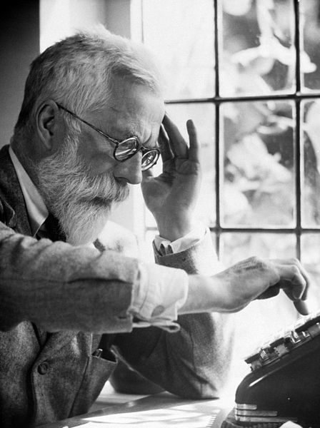

### Land acknowledgment

* This work was done at URegina on Treaty 4 lands

### Funding

.row[

.col-6[
.center[]
]

.col-6[
.center[]
]

]

### Data

* Woolway and colleagues for archiving the lake surface water data
* Lake ice data from [Global Lake and River Ice Phenology Database](http://nsidc.org/data/G01377.html)
* Lake ice study joint work with Stefano Mezzini

<!-- ### Slides

* HTML Slide deck [bit.ly/hifmb-talk](http://bit.ly/hifmb-talk) &copy; Simpson (2020) [](http://creativecommons.org/licenses/by/4.0/) -->

???

This research was conducted while I was at the University of Regina, which is situated on the territories of the nay-hi-yuh-wuk (Cree; nêhiyawak), uh-nish-i-naa-payk (Salteaux; Anihšināpēk), Dakota, Lakota, and Nakoda, and the homeland of the Métis/Michif Nation.

---
class: inverse
background-image: url('./resources/franki-chamaki-z4H9MYmWIMA-unsplash.jpg')
background-size: cover

```{r setup, include=FALSE, cache=FALSE}
options(htmltools.dir.version = FALSE)
knitr::opts_chunk$set(cache = TRUE, dev = 'svg', echo = FALSE, message = FALSE, warning = FALSE,
                      fig.height=6, fig.width = 1.777777*6)

library("curl")
library("ggplot2")
library("dplyr")
library("tibble")
library('tidyr')
library('mgcv')
library('forcats')
library('mvnfast')
library('purrr')
library('gganimate')
library('gratia')
library('readr')
library('cowplot')
theme_set(theme_minimal(base_size = 14, base_family = 'Fira Sans'))
library('readxl')
library('here')

## constats
anim_width <- 1000
anim_height <- anim_width / 1.77777777
anim_dev <- 'png'
anim_res <- 200
```

# 

.footnote[
<a style="background-color:black;color:white;text-decoration:none;padding:4px 6px;font-family:-apple-system, BlinkMacSystemFont, &quot;San Francisco&quot;, &quot;Helvetica Neue&quot;, Helvetica, Ubuntu, Roboto, Noto, &quot;Segoe UI&quot;, Arial, sans-serif;font-size:12px;font-weight:bold;line-height:1.2;display:inline-block;border-radius:3px" href="https://unsplash.com/@franki?utm_medium=referral&amp;utm_campaign=photographer-credit&amp;utm_content=creditBadge" target="_blank" rel="noopener noreferrer" title="Download free do whatever you want high-resolution photos from Franki Chamaki"><span style="display:inline-block;padding:2px 3px"><svg xmlns="http://www.w3.org/2000/svg" style="height:12px;width:auto;position:relative;vertical-align:middle;top:-2px;fill:white" viewBox="0 0 32 32"><title>unsplash-logo</title><path d="M10 9V0h12v9H10zm12 5h10v18H0V14h10v9h12v-9z"></path></svg></span><span style="display:inline-block;padding:2px 3px">Franki Chamaki</span></a>
]

???

We learn from data because it can highlight our preconceptions and biases

---

# Learning from data

```{r lm-plot, fig.height=6, fig.width = 1.777777*6}
## simulate some data for a linear model
set.seed(1)
N <- 250
lm_dat <- tibble(x = runif(N), y = 0.5 + (2.1 * x) + rnorm(N, sd = 0.5))
## plot
ggplot(lm_dat, aes(x = x, y = y)) +
    geom_point() +
    geom_smooth(method = 'lm') +
    theme_minimal(base_size = 20, base_family = 'Fira Sans')
```

???

Learning from data could be a simple as fitting a linear regression model...

---
class: inverse
background-image: url('./resources/deep-learning-turned-up-to-11.jpg')
background-size: contain

# 

???

Or as complex as fitting a sophisticated multi-layered neural network trained on huge datasets or corpora

---

# Learning involves trade-offs

.row[
.col-6[
.center[]
]

.col-6[
.center[]
]
]

???

Learning from data involves trade offs

We can have models that fit our data well &mdash; low bias &mdash; but which are highly variable, or

We can fit models that have lower variance, but these tend to have higher bias, i.e. fit the data less well

A linear regression model is very interpretable but unless the underlying relationship is linear it will have poor fit

Deep learning may fit data incredibly well but the model is very difficult to interpret and understand

---

# Generalized Additive Models

<br />


.references[Source: [GAMs in R by Noam Ross](https://noamross.github.io/gams-in-r-course/)]

???

GAMs are an intermediate-complexity model

* can learn from data without needing to be informed by the user
* remain interpretable because we can visualize the fitted features

```{r smooth-fun-animation, results = FALSE}
f <- function(x) {
    x^11 * (10 * (1 - x))^6 + ((10 * (10 * x)^3) * (1 - x)^10)
}

draw_beta <- function(n, k, mu = 1, sigma = 1) {
    rmvn(n = n, mu = rep(mu, k), sigma = diag(rep(sigma, k)))
}

weight_basis <- function(bf, x, n = 1, k, ...) {
    beta <- draw_beta(n = n, k = k, ...)
    out <- sweep(bf, 2L, beta, '*')
    colnames(out) <- paste0('f', seq_along(beta))
    out <- as_tibble(out)
    out <- add_column(out, x = x)
    out <- pivot_longer(out, -x, names_to = 'bf', values_to = 'y')
    out
}

random_bases <- function(bf, x, draws = 10, k, ...) {
    out <- rerun(draws, weight_basis(bf, x = x, k = k, ...))
    out <- bind_rows(out)
    out <- add_column(out, draw = rep(seq_len(draws), each = length(x) * k),
                      .before = 1L)
    class(out) <- c("random_bases", class(out))
    out
}

plot.random_bases <- function(x, facet = FALSE) {
    plt <- ggplot(x, aes(x = x, y = y, colour = bf)) +
        geom_line(lwd = 1, alpha = 0.75) +
        guides(colour = FALSE)
    if (facet) {
        plt + facet_wrap(~ draw)
    }
    plt
}

normalize <- function(x) {
    rx <- range(x)
    z <- (x - rx[1]) / (rx[2] - rx[1])
    z
}

set.seed(1)
N <- 500
data <- tibble(x     = runif(N),
               ytrue = f(x),
               ycent = ytrue - mean(ytrue),
               yobs  = ycent + rnorm(N, sd = 0.5))

k <- 10
knots <- with(data, list(x = seq(min(x), max(x), length = k)))
sm <- smoothCon(s(x, k = k, bs = "cr"), data = data, knots = knots)[[1]]$X
colnames(sm) <- levs <- paste0("f", seq_len(k))
basis <- pivot_longer(cbind(sm, data), -(x:yobs), names_to = 'bf')
basis

set.seed(2)
bfuns <- random_bases(sm, data$x, draws = 20, k = k)

smooth <- bfuns %>%
    group_by(draw, x) %>%
    summarise(spline = sum(y)) %>%
    ungroup()

p1 <- ggplot(smooth) +
    geom_line(data = smooth, aes(x = x, y = spline), lwd = 1.5) +
    labs(y = 'f(x)', x = 'x') +
    theme_minimal(base_size = 16, base_family = 'Fira Sans')

smooth_funs <- animate(
    p1 + transition_states(draw, transition_length = 4, state_length = 2) + 
    ease_aes('cubic-in-out'),
    nframes = 200, height = anim_height, width = anim_width, res = anim_res, dev = anim_dev)

anim_save('resources/spline-anim.gif', smooth_funs)
```

---

# HadCRUT4 time series

```{r hadcrut-temp-example, fig.height = 6}
## Load Data
tmpf <- tempfile()
curl_download("https://www.metoffice.gov.uk/hadobs/hadcrut4/data/current/time_series/HadCRUT.4.6.0.0.annual_nh.txt", tmpf)
gtemp <- read.table(tmpf, colClasses = rep("numeric", 12))[, 1:2] # only want some of the variables
names(gtemp) <- c("Year", "Temperature")
gtemp <- as_tibble(gtemp)

## Plot
gtemp_plt <- ggplot(gtemp, aes(x = Year, y = Temperature)) +
    geom_line() + 
    geom_point() +
    labs(x = 'Year', y = expression(Temperature ~ Anomaly ~ degree*C)) +
    theme_minimal(base_size = 20, base_family = 'Fira Sans')
gtemp_plt
```

---

# Polynomials

```{r hadcrut-temp-polynomial}
p <- c(1,3,8,15)
N <- 300
newd <- with(gtemp, data.frame(Year = seq(min(Year), max(Year), length = N)))
polyFun <- function(i, data = data) {
    lm(Temperature ~ poly(Year, degree = i), data = data)
}
mods <- lapply(p, polyFun, data = gtemp)
pred <- vapply(mods, predict, numeric(N), newdata = newd)
colnames(pred) <- p
newd <- cbind(newd, pred)
polyDat <- gather(newd, Degree, Fitted, - Year)
polyDat <- mutate(polyDat, Degree = ordered(Degree, levels = p))
gtemp_plt + geom_line(data = polyDat, mapping = aes(x = Year, y = Fitted, colour = Degree),
                      size = 1.5, alpha = 0.9) +
    scale_color_brewer(name = "Degree", palette = "PuOr") +
    theme(legend.position = "right")
```

---

# How is a GAM different?

In LM we model the mean of data as a sum of linear terms:

$$y_i = \beta_0 + \sum_j \color{red}{ \beta_j x_{ji}} + \epsilon_i$$

A GAM is a sum of _smooth functions_ or _smooths_

$$y_i = \beta_0 + \sum_j \color{red}{s_j(x_{ji})} + \epsilon_i$$

where $\epsilon_i \sim N(0, \sigma^2)$

---

# More generally

$$y_i \sim \mathcal{D}(\mu_i, \phi)$$

$$g(\mu_i) = \boldsymbol{A}_i\boldsymbol{\gamma} + \sum_j f_j(x_{ji})$$

---
class: inverse middle center subsection

# GAMs use splines

---
class: inverse
background-image: url('resources/wiggly-things.png')
background-size: contain

???

---

# Splines formed from basis functions

```{r basis-functions, fig.height=6, fig.width = 1.777777*6}
ggplot(basis,
       aes(x = x, y = value, colour = bf)) +
    geom_line(lwd = 2, alpha = 0.5) +
    guides(colour = FALSE) +
    labs(x = 'x', y = 'b(x)') +
    theme_minimal(base_size = 20, base_family = 'Fira Sans')
```

???

Splines are built up from basis functions

Here I'm showing a cubic regression spline basis with 10 knots/functions

We weight each basis function to get a spline. Here all the basisi functions have the same weight so they would fit a horizontal line

---

# Weight basis functions &#8680; spline

```{r basis-function-animation, results = 'hide'}
bfun_plt <- plot(bfuns) +
    geom_line(data = smooth, aes(x = x, y = spline),
              inherit.aes = FALSE, lwd = 1.5) +
    labs(x = 'x', y = 'f(x)') +
    theme_minimal(base_size = 14, base_family = 'Fira Sans')

bfun_anim <- animate(
    bfun_plt + transition_states(draw, transition_length = 4, state_length = 2) + 
    ease_aes('cubic-in-out'),
    nframes = 200, height = anim_height, width = anim_width, res = anim_res, dev = anim_dev)

anim_save('resources/basis-fun-anim.gif', bfun_anim)
```

.center[]

???

But if we choose different weights we get more wiggly spline

Each of the splines I showed you earlier are all generated from the same basis functions but using different weights

---

# How do GAMs learn from data?

```{r example-data-figure, fig.height=6, fig.width = 1.777777*6}
data_plt <- ggplot(data, aes(x = x, y = ycent)) +
    geom_line(col = 'goldenrod', lwd = 2) +
    geom_point(aes(y = yobs), alpha = 0.2, size = 3) +
    labs(x = 'x', y = 'f(x)') +
    theme_minimal(base_size = 20, base_family = 'Fira Sans')
data_plt
```

???

How does this help us learn from data?

Here I'm showing a simulated data set, where the data are drawn from the orange functions, with noise. We want to learn the orange function from the data

---

# Maximise penalised log-likelihood &#8680; &beta;

```{r basis-functions-anim, results = "hide"}
sm2 <- smoothCon(s(x, k = k, bs = "cr"), data = data, knots = knots)[[1]]$X
beta <- coef(lm(ycent ~ sm2 - 1, data = data))
wtbasis <- sweep(sm2, 2L, beta, FUN = "*")
colnames(wtbasis) <- colnames(sm2) <- paste0("F", seq_len(k))
## create stacked unweighted and weighted basis
basis <- as_tibble(rbind(sm2, wtbasis)) %>%
    add_column(x = rep(data$x, times = 2),
               type = rep(c('unweighted', 'weighted'), each = nrow(sm2)),
               .before = 1L)
##data <- cbind(data, fitted = rowSums(scbasis))
wtbasis <- as_tibble(rbind(sm2, wtbasis)) %>%
    add_column(x      = rep(data$x, times = 2),
               fitted = rowSums(.),
               type   = rep(c('unweighted', 'weighted'), each = nrow(sm2))) %>%
    pivot_longer(-(x:type), names_to = 'bf')
basis <- pivot_longer(basis, -(x:type), names_to = 'bf')

p3 <- ggplot(data, aes(x = x, y = ycent)) +
    geom_point(aes(y = yobs), alpha = 0.2) +
    geom_line(data = basis,
              mapping = aes(x = x, y = value, colour = bf),
              lwd = 1, alpha = 0.5) +
    geom_line(data = wtbasis,
              mapping = aes(x = x, y = fitted), lwd = 1, colour = 'black', alpha = 0.75) +
    guides(colour = FALSE) +
    labs(y = 'f(x)', x = 'x') +
    theme_minimal(base_size = 16, base_family = 'Fira Sans')

crs_fit <- animate(p3 + transition_states(type, transition_length = 4, state_length = 2) + 
                   ease_aes('cubic-in-out'),
                   nframes = 100, height = anim_height, width = anim_width, res = anim_res,
                   dev = anim_dev)

anim_save('./resources/gam-crs-animation.gif', crs_fit)
```

.center[]

???

Fitting a GAM involves finding the weights for the basis functions that produce a spline that fits the data best, subject to some constraints

---
class: inverse middle center subsection

# Avoid overfitting our sample

---
class: inverse middle center subsection

# Use a wiggliness penalty &mdash; avoid fitting too wiggly models

---

# Wiggliness

$$\int_{\mathbb{R}} [f^{\prime\prime}]^2 dx = \boldsymbol{\beta}^{\mathsf{T}}\mathbf{S}\boldsymbol{\beta} = \large{W}$$

$\mathbf{S}$ is a *penalty* matrix

$\boldsymbol{\beta}^{\mathsf{T}}\mathbf{S}\boldsymbol{\beta}$ is a *quadratic* penalty

---

# Making wiggliness matter

$W$ measures **wiggliness**

(log) likelihood measures closeness to the data

We use a **smoothing parameter** $\lambda$ to define the trade-off, to find the spline coefficients $\boldsymbol{\beta}$ (and $\boldsymbol{\gamma}$) that maximize the **penalized** log-likelihood

$$\mathcal{L}_p = \log(\text{Likelihood})  - \lambda W$$

---

# HadCRUT4 time series

```{r hadcrut-temp-penalty}
K <- 40
lambda <- c(10000, 1, 0.01, 0.00001)
N <- 300
newd <- with(gtemp, data.frame(Year = seq(min(Year), max(Year), length = N)))
fits <- lapply(lambda, function(lambda) gam(Temperature ~ s(Year, k = K, sp = lambda), data = gtemp))
pred <- vapply(fits, predict, numeric(N), newdata = newd)
op <- options(scipen = 100)
colnames(pred) <- lambda
newd <- cbind(newd, pred)
lambdaDat <- gather(newd, Lambda, Fitted, - Year)
lambdaDat <- transform(lambdaDat, Lambda = factor(paste("lambda ==", as.character(Lambda)),
                                                  levels = paste("lambda ==", as.character(lambda))))

gtemp_plt + geom_line(data = lambdaDat, mapping = aes(x = Year, y = Fitted, group = Lambda),
                      size = 1, colour = "#e66101") +
    facet_wrap( ~ Lambda, ncol = 2, labeller = label_parsed)
options(op)
```


---

# Picking the right wiggliness

.pull-left[
Two ways to think about how to optimize $\lambda$:

* Predictive: Minimize out-of-sample error
* Bayesian:  Put priors on our basis coefficients
]

.pull-right[
Many methods: AIC, Mallow's $C_p$, GCV, ML, REML

* **Practically**, use **REML**, because of numerical stability
* Hence `gam(..., method='REML')`
]

.center[

]

---

# Maximum allowed wiggliness

We set **basis complexity** or "size" $k$

This is _maximum wigglyness_, can be thought of as number of small functions that make up a curve

Once smoothing is applied, curves have fewer **effective degrees of freedom (EDF)**

EDF < $k$

---

# Maximum allowed wiggliness

$k$ must be *large enough*, the $\lambda$ penalty does the rest

*Large enough* &mdash; space of functions representable by the basis includes the true function or a close approximation to the tru function

Bigger $k$ increases computational cost

In **mgcv**, default $k$ values are arbitrary &mdash; after choosing the model terms, this is the key user choice

**Must be checked!** &mdash; `gam.check()`

---

# Knots?

Can avoid the knot placement problem using low-rank thin plate regression splines

---

# Thin plate splines
Default spline in {mgcv} is `bs = "tp"`

Thin plate splines &mdash; knot at every unique data value

Penalty on wiggliness (default is 2nd derivative)

As many basis functions as data

This is wasteful

---

# Low rank thin plate splines

Thin plate regression spline

Form the full TPS basis

Take the wiggly basis functions and eigen-decompose it

Concentrates the *information* in the TPS basis into as few as possible new basis functions

Retain the `k` eigenvectors with the `k` largest eigenvalues as the new basis

Fit the GAM with those new basis functions

---

# TPRS basis & penalty

.center[
```{r, echo = FALSE, dev = "png", out.width = "100%", dpi = 300}
new_df <- with(gtemp, tibble(Year = seq_min_max(Year, n = 100)))
m <-  gam(Temperature ~ s(Year), data = gtemp, method = "REML")
S <- penalty(m, smooth = "s(Year)")
bfun <- basis(s(Year), data = new_df, constraints = TRUE)
library("patchwork")
p1 <- draw(bfun) + facet_wrap(~ bf)
p2 <- draw(S)
p1 + p2
```
]

---

# CRS basis & penalty

.center[
```{r, echo = FALSE, dev = "png", out.width = "100%", dpi = 300}
m <- gam(Temperature ~ s(Year, bs = "cr"), data = gtemp, method = "REML")
S <- penalty(m, smooth = "s(Year)")
library("patchwork")
bfun_cc <- basis(s(Year, bs = "cr"), data = new_df, constraints = TRUE)
p1 <- draw(bfun_cc) + facet_wrap(~ bf)
p2 <- draw(S)
p1 + p2
```
]

---

# Fitted GAM

```{r hadcrutemp-fitted-gam}
m <- gamm(Temperature ~ s(Year), data = gtemp, correlation = corARMA(form = ~ Year, p = 1))

N <- 300
newd <- as_tibble(with(gtemp, data.frame(Year = seq(min(Year), max(Year), length = N))))
pred <- as_tibble(as.data.frame(predict(m$gam, newdata = newd, se.fit = TRUE,
                                        unconditional = TRUE)))
pred <- bind_cols(newd, pred) %>%
    mutate(upr = fit + 2 * se.fit, lwr = fit - 2*se.fit)

ggplot(gtemp, aes(x = Year, y = Temperature)) +
    geom_point() +
    geom_ribbon(data = pred,
                mapping = aes(ymin = lwr, ymax = upr, x = Year), alpha = 0.4, inherit.aes = FALSE) +
    geom_line(data = pred,
              mapping = aes(y = fit, x = Year), inherit.aes = FALSE, size = 1, colour = "#025196") +
    labs(x = 'Year', y = expression(Temeprature ~ degree*C)) +
    theme_minimal(base_size = 20, base_family = 'Fira Sans')
```

---
class: inverse middle center subsection

# Why GAMs?

---

# Why GAMs?

Originally motivated by messy irregularly-spaced time series data

--

.center[
```{r frontiers-paper, echo = FALSE}
knitr::include_graphics(here('resources', 'frontiers-paper-title.png'))
```
]

Simpson (2018, Frontiers in Ecology & Evolution)

---

# Why GAMs?

Originally motivated by messy irregularly-spaced time series data

.row[

.col-6[
* sediment cores

* samples irregularly spaced in time
]

.col-6[
```{r tom-core, echo = FALSE, out.width = "75%", fig.align = "center"}
knitr::include_graphics(here('resources', 'tom_core.jpg'))
```
]
]

---

# Why GAMs?

Originally motivated by messy irregularly-spaced time series data

Interest in the "trends" themselves not (necessarily) the temporal dependence

(Relatively) Easy to fit & &mdash; user friendly tools

Familiar

---
class: inverse middle center subsection

#  Galveston Bay

---

# Galveston Bay

.row[

.col-6[
Cross Validated question

> I have a dataset of water temperature measurements taken from a large waterbody at irregular intervals over a period of decades. (Galveston Bay, TX if you’re interested)

]

.col-6[

.center[
```{r cross-validated, echo = FALSE}
knitr::include_graphics(here('resources', 'cross-validated.png'))
```
]

]
]


<https://stats.stackexchange.com/q/244042/1390>

---

# Galveston Bay

```{r load-galveston}
galveston <- read_csv(here('data', 'gbtemp.csv')) %>%
    mutate(datetime = as.POSIXct(paste(DATE, TIME), format = '%m/%d/%y %H:%M', tz = "CDT"),
           STATION_ID = factor(STATION_ID), DoY = as.numeric(format(datetime, format = '%j')),
           ToD = as.numeric(format(datetime, format = '%H')) +
               (as.numeric(format(datetime, format = '%M')) / 60))
galveston
```

---

# Galveston Bay model description

$$
\begin{align}
  \begin{split}
      \mathrm{E}(y_i) & = \alpha + f_1(\text{ToD}_i) + f_2(\text{DoY}_i) + f_3(\text{Year}_i) + f_4(\text{x}_i, \text{y}_i) + \\
        & \quad f_5(\text{DoY}_i, \text{Year}_i) + f_6(\text{x}_i, \text{y}_i, \text{ToD}_i) + \\
        & \quad f_7(\text{x}_i, \text{y}_i, \text{DoY}_i) + f_8(\text{x}_i, \text{y}_i, \text{Year}_i)
  \end{split}
\end{align}
$$

* $\alpha$ is the model intercept,
* $f_1(\text{ToD}_i)$ is a smooth function of time of day,
* $f_2(\text{DoY}_i)$ is a smooth function of day of year ,
* $f_3(\text{Year}_i)$ is a smooth function of year,
* $f_4(\text{x}_i, \text{y}_i)$ is a 2D smooth of longitude and latitude,

---

# Galveston Bay model description

$$
\begin{align}
  \begin{split}
      \mathrm{E}(y_i) & = \alpha + f_1(\text{ToD}_i) + f_2(\text{DoY}_i) + f_3(\text{Year}_i) + f_4(\text{x}_i, \text{y}_i) + \\
        & \quad f_5(\text{DoY}_i, \text{Year}_i) + f_6(\text{x}_i, \text{y}_i, \text{ToD}_i) + \\
        & \quad f_7(\text{x}_i, \text{y}_i, \text{DoY}_i) + f_8(\text{x}_i, \text{y}_i, \text{Year}_i)
  \end{split}
\end{align}
$$

* $f_5(\text{DoY}_i, \text{Year}_i)$ is a tensor product smooth of day of year and year,
* $f_6(\text{x}_i, \text{y}_i, \text{ToD}_i)$ tensor product smooth of location & time of day
* $f_7(\text{x}_i, \text{y}_i, \text{DoY}_i)$ tensor product smooth of location day of year& 
* $f_8(\text{x}_i, \text{y}_i, \text{Year}_i$ tensor product smooth of location & year

---

# Galveston Bay model description

$$
\begin{align}
  \begin{split}
      \mathrm{E}(y_i) & = \alpha + f_1(\text{ToD}_i) + f_2(\text{DoY}_i) + f_3(\text{Year}_i) + f_4(\text{x}_i, \text{y}_i) + \\
        & \quad f_5(\text{DoY}_i, \text{Year}_i) + f_6(\text{x}_i, \text{y}_i, \text{ToD}_i) + \\
        & \quad f_7(\text{x}_i, \text{y}_i, \text{DoY}_i) + f_8(\text{x}_i, \text{y}_i, \text{Year}_i)
  \end{split}
\end{align}
$$

Effectively, the first four smooths are the main effects of

1. time of day,
2. season,
3. long-term trend,
4. spatial variation

---

# Galveston Bay model description

$$
\begin{align}
  \begin{split}
      \mathrm{E}(y_i) & = \alpha + f_1(\text{ToD}_i) + f_2(\text{DoY}_i) + f_3(\text{Year}_i) + f_4(\text{x}_i, \text{y}_i) + \\
        & \quad f_5(\text{DoY}_i, \text{Year}_i) + f_6(\text{x}_i, \text{y}_i, \text{ToD}_i) + \\
        & \quad f_7(\text{x}_i, \text{y}_i, \text{DoY}_i) + f_8(\text{x}_i, \text{y}_i, \text{Year}_i)
  \end{split}
\end{align}
$$

whilst the remaining tensor product smooths model smooth interactions between the stated covariates, which model

5. how the seasonal pattern of temperature varies over time,
6. how the time of day effect varies spatially,
7. how the seasonal effect varies spatially, and
8. how the long-term trend varies spatially

---

# Galveston Bay &mdash; full model

```{r galveston-full-model, echo = TRUE}
knots <- list(DoY = c(0.5, 366.5))
m <- bam(MEASUREMENT ~
             s(ToD, k = 10) +
             s(DoY, k = 12, bs = 'cc') +
             s(YEAR, k = 30) +
             s(LONGITUDE, LATITUDE, k = 100, bs = 'ds', m = c(1, 0.5)) +
             ti(DoY, YEAR, bs = c('cc', 'tp'), k = c(12, 15)) +
             ti(LONGITUDE, LATITUDE, ToD, d = c(2,1), bs = c('ds','tp'),
                m = list(c(1, 0.5), NA), k = c(20, 10)) +
             ti(LONGITUDE, LATITUDE, DoY, d = c(2,1), bs = c('ds','cc'),
                m = list(c(1, 0.5), NA), k = c(25, 12)) +
             ti(LONGITUDE, LATITUDE, YEAR, d = c(2,1), bs = c('ds','tp'),
                m = list(c(1, 0.5), NA), k = c(25, 15)),
         data = galveston, method = 'fREML', knots = knots,
         nthreads = c(4, 1), discrete = TRUE)
```

---

# Galveston Bay &mdash; full model plot

```{r galveston-full-model-plot, fig.height = 5.5}
plot(m, pages = 1, scheme = 2, shade = TRUE)
```

```{r galveston-full-predict, echo = FALSE}
pdata <- with(galveston,
              expand.grid(ToD = 12,
                          DoY = 180,
                          YEAR = seq(min(YEAR), max(YEAR), by = 1),
                          LONGITUDE = seq(min(LONGITUDE), max(LONGITUDE), length = 100),
                          LATITUDE  = seq(min(LATITUDE), max(LATITUDE), length = 100)))
fit <- predict(m, pdata)
ind <- exclude.too.far(pdata$LONGITUDE, pdata$LATITUDE,
                       galveston$LONGITUDE, galveston$LATITUDE, dist = 0.1)
fit[ind] <- NA
pred <- cbind(pdata, Fitted = fit)
```


```{r galveston-full-predict-plot, fig.show = 'hide'}
plt <- ggplot(pred, aes(x = LONGITUDE, y = LATITUDE)) +
    geom_raster(aes(fill = Fitted)) + facet_wrap(~ YEAR, ncol = 12) +
    scale_fill_viridis_c(name = expression(degree*C), option = 'plasma', na.value = 'transparent') +
    coord_quickmap() +
    theme(legend.position = 'right',
          axis.text.x = element_blank(),
          axis.text.y = element_blank()) +
    labs(x = NULL, y = NULL)
plt
```

---

# Galveston Bay &mdash; plot

```{r galveston-full-predict-plot, echo = FALSE}
```

---

# Galveston Bay &mdash; plot

.center[]

---

# Galveston Bay &mdash; plot trends

```{r galveston-trends-by-month}
pdata <- with(galveston,
              expand.grid(ToD = 12,
                          DoY = c(1, 90, 180, 270),
                          YEAR = seq(min(YEAR), max(YEAR), length = 500),
                          LONGITUDE = -94.8751,
                          LATITUDE  = 29.50866))

fit <- data.frame(predict(m, newdata = pdata, se.fit = TRUE))
fit <- transform(fit, upper = fit + (2 * se.fit), lower = fit - (2 * se.fit))
pred <- cbind(pdata, fit)

plt2 <- ggplot(pred, aes(x = YEAR, y = fit, group = factor(DoY))) +
    geom_ribbon(aes(ymin = lower, ymax = upper), fill = 'grey', alpha = 0.5) +
    geom_line() + facet_wrap(~ DoY, scales = 'free_y') +
    labs(x = NULL, y = expression(Temperature ~ (degree * C)))
plt2
```

---
class: inverse middle center subsection

# Climate change affecting lake temperatures?

---

```{r load-process-lake-temp-data}
## load GEV support functions
source("./functions/gev-distribution.R")

## load data
lake <- read_csv("./data/lake-temperature-time-series.csv",
                 skip = 1L,         # setting col name so skip those provided
                 col_names = c('date','temperature','lake'),
                 col_types = 'Ddc') # D = Date, d = double, c = character

## prepare data
## add some useful variables
lake <- mutate(lake,
               year  = as.numeric(format(date, format = '%Y')),
               lake  = factor(lake),
               lake  = fct_recode(lake,
                                  `Blelham Tarn` = 'BLEL',
                                  `Esthwaite Water` = 'ESTH',
                                  Feeagh = 'FEEAGH',
                                  `Loch Leven` = 'LEVEN',
                                  `Vättern` = 'VATTERN',
                                  `Windermere North` = 'NBAS',
                                  `Windermere South` = 'SBAS',
                                  `Wörthersee` = 'WORTHERSEE',
                                  `Zürichsee` = 'ZURICH'))

## compute annual minimum lake water temperature
minima <- lake %>% group_by(lake, year) %>%
    summarize(minimum = min(temperature, na.rm = TRUE)) %>%
    mutate(cyear = year - median(seq(min(year), max(year), by = 1L)),
           neg_min = -minimum) %>% 
    ungroup()

## store the median year that we used to centre year by
med_year <- minima %>% select(year) %>%
    summarise(median_year = median(year)) %>%
    pull(median_year)

## constants for plots
min_temp_label <- 'Surface temperature (°C)'

## model set up
ctrl <- gam.control(nthreads = 4) # use multiple threads to fit

## model
m1 <- gam(list(neg_min ~ s(cyear, lake, bs = 'fs'),
               ~ s(cyear, lake, bs = 'fs'),
               ~ s(cyear, lake, bs = 'fs')),
          data = minima, method = 'REML',
          family = gevlss(link = list('identity', 'identity', 'logit')),
          control = ctrl, optimizer = 'efs')

fit <- fitted(m1)
mu  <- fit[,1]
rho <- fit[,2]
xi  <- fit[,3]
fv  <- mu + exp(rho) * (gamma(1 - xi) - 1) / xi

## Get the predicted expected response...
m1_diag <- tibble(fitted = -(mu + exp(rho) * (gamma(1 - xi) - 1) / xi),
                  resid  = residuals(m1))
m1_diag <- bind_cols(minima, m1_diag)

## the next block of code simulates ~95% confidence interval
## on the fitted values only, and plots this with the observed
## data
sims <- fitted_draws_gev_gam(m1, nsim = 10000, seed = 3476,
                             minima = TRUE, ncores = 4)
upper <- apply(sims, 1L, quantile, probs = 0.975)
lower <- apply(sims, 1L, quantile, probs = 0.025)

m1_diag <- add_column(m1_diag, lower = lower, upper = upper)

## repeat this but for N values spread evenly over time series
## of each lake
N <- 200

## this requires a function to be applied to the data for each lake
## this simply returns a tibble with `lake`, `year`, `cyear`
## with `year` being N values spread evenly from the first year to
## the last
year_seq <- function(tbl, n, median_year) {
    df <- tibble(lake = rep(unique(tbl$lake), n),
                 year = seq_min_max(tbl$year, n = n))
    mutate(df, cyear = year - median_year)
}

## do the split-apply-combine to get year sequences per lake
newd <- minima %>% group_by(lake) %>%
    split(.$lake) %>%
    map_dfr(year_seq, n = N, median_year = med_year)

## add expected values from esimtated GEV on to the prediction data
m1_pred <- mutate(newd, fitted = -expected_gev(m1, newdata = newd))

## simulate 10000 draws from posterior of the model and return expected
## values from the GEV for each posterior draw
sims <- fitted_draws_gev_gam(m1, newdata = newd, nsim = 10000, seed = 3476,
                             minima = TRUE, ncores = 4)
## compute ~ 95% confidence intervals
upper <- apply(sims, 1L, quantile, probs = 0.975)
lower <- apply(sims, 1L, quantile, probs = 0.025)
## ...and add these to the prediction data
m1_pred <- add_column(m1_pred, lower = lower, upper = upper)

## Next blocks of code will compute the density of the estimated GEV
## distributions for common start years and end years for each lake
##
## We use the earliest and latest years for which we have data for all lakes
start_year <- minima %>% group_by(lake) %>%
    summarise(min_year = min(year)) %>%
    ungroup() %>%
    pull(min_year) %>%
    max()
## ...
last_year <- minima %>% group_by(lake) %>%
    summarise(max_year = max(year)) %>%
    ungroup() %>%
    pull(max_year) %>%
    min()

## Data to predict at; expansion of the start and end years and the 9 lakes
newd <- crossing(year = c(start_year, last_year),
                 lake = levels(minima$lake)) %>%
    mutate(cyear = year - med_year)

## predict GEV parameters for each lake in the two years
pred <- predict(m1, newdata = newd, type = 'response')
colnames(pred) <- c('mu','sigma','xi')
## need to put these on the correct scales
##  mu:    negated because this is block maxima model and so we modelled
##           the negative of the minima (exactly equivalent)
##  sigma: gevlss() sigma parameterised in terms of log(sigma) == rho
##           so we use the inverse link to back-transform
## probably should do this properly using the inverse link functions
##   in here('functions') in case we change the links in the model...
pred <- as_tibble(pred) %>%
    mutate(mu = -mu, sigma = exp(sigma))

## Need all combinations of GEV parameters and the sequence of
## minimum temperatures to evaluate density over (`x`)
gev_pars <- crossing(pred, x = seq(-1.5, 8, length.out = 1000))

## stick prediction data and predicted GEV parameters together
## Note: can't do this before we create `gev_pars()` via `crossing()`
##         as we don't want all combinations of *all* variables
pred <- bind_cols(newd, pred)

## compute the GEV density for all lakes & prepare data for plotting
gev_dens <- left_join(gev_pars, pred, by = c('mu', 'sigma', 'xi')) %>%
    select(-cyear) %>% 
    mutate(density = dgev(x, mu, sigma, xi),
           year = factor(year))
```

# 

.references[
Data: Woolway *et al* (2019) *Climate Change* **155**, 81&ndash;94 [doi: 10/c7z9](http://doi.org/c7z9)
]

```{r plot-blelham}
ggplot(filter(lake, lake == 'Blelham Tarn'), aes(x = date, y = temperature)) +
    geom_line() +
    guides(colour = FALSE) +
    theme_minimal(base_size = 20, base_family = 'Fira Sans') +
    labs(x = NULL, y = min_temp_label, title = 'Blelham Tarn, UK')
```

---
class: inverse middle center subsection

# Why worry about minimum temperatures?

---

# Why worry about minimum temperatures?

Annual minimum temperature is a strong control on many in-lake processes (eg Hampton *et al* 2017)

Extreme events can have long-lasting effects on lake ecology &mdash; mild winter in Europe 2006&ndash;7 (eg Straile *et al* 2010)

Reduction in habitat or refugia for cold-adapted species

* Arctic charr (*Salvelinus alpinus*)
* Opossum shrimp (*Mysis salemaai*)

.references[Hampton *et al* (2017). Ecology under lake ice. *Ecology Letters* **20**, 98–111. [doi: 10/f3tpzh](http://doi.org/f3tpzh)

Straile *et al* (2010). Effects of a half a millennium winter on a deep lake &mdash; a shape of things to come? *Global Change Biology* **16**, 2844–2856. [doi: 10/bx6t4d](http://doi.org/bx6t4d)]

---

# Multiple time series &#8680; HGAM

```{r plot-all-lakes}
ggplot(lake, aes(x = date, y = temperature, colour = lake)) +
    geom_line() +
    facet_wrap(~ lake) +
    guides(colour = FALSE) +
    theme_minimal(base_size = 20, base_family = 'Fira Sans') +
    labs(x = NULL, y = min_temp_label)
```

---
class: inverse center middle large-subsection

# Central Limit Theorem

???

Central limit theorem shows us that the Gaussian or normal distribution is the sampling distribution for many sample statistics, including sample means, as samples sizes become large

Central limit theorem underlies much of the theory that justifies much of the statistics you learn about in your statistics courses, and supports the use of the Gaussian or normal distribution

---

# Annual minimum temperature

```{r plot-minima}
ggplot(minima, aes(x = year, y = minimum, colour = lake)) +
    geom_line(lwd = 1) +
    facet_wrap(~ lake) +
    guides(colour = FALSE) +
    theme_minimal(base_size = 20, base_family = 'Fira Sans') +
    labs(x = NULL, y = min_temp_label)
```

---
class: inverse middle center large-subsection

# Block Minima

---

# Fisher&ndash;Tippett&ndash;Gnedenko theorem

> The **maximum** of a sample of *iid* random variables after proper renormalization can only converge in distribution to one of three possible distributions; the *Gumbel* distribution, the *Fréchet* distribution, or the *Weibull* distribution.

.row[

.col-4[
.center[
.smaller[Source: [Wikimedia Commons](https://commons.wikimedia.org/wiki/File:%E0%A4%B0%E0%A5%8B%E0%A4%A8%E0%A4%BE%E0%A4%A1%E0%A5%8D.jpg)]]
]
.col-4[ 
.center[]
.smaller[Source: [ral.ucar.edu](https://ral.ucar.edu/projects/extremes/Extremes/history.html)]
]
.col-4[ 
.center[]
.smaller[Source: [Wikimedia Commons](https://commons.wikimedia.org/wiki/File:Gnedenko.png)]
]

]

---
class: inverse middle center large-subsection

# Block Minima&hellip;?

---

# Negate the minima &#8680; maxima

```{r plot-minima-negated}
ggplot(minima, aes(x = year, y = -minimum, colour = lake)) +
    geom_line(lwd = 1) +
    facet_wrap(~ lake) +
    guides(colour = FALSE) +
    theme_minimal(base_size = 20, base_family = 'Fira Sans') +
    labs(x = NULL, y = min_temp_label)
```

---
class: inverse middle center large-subsection

# Three Distributions&hellip;?

---

# Generalised extreme value distribution

In 1978 Daniel McFadden demonstrated the common functional form for all three distributions — the GEVD

$$G(y) = \exp \left \{ - \left [ 1 + \xi \left ( \frac{y - \mu}{\sigma} \right ) \right ]_{+}^{-1/\xi} \right \}$$

.row[
.col-5[
Three parameters to estimate

* location $\mu$,
* scale $\sigma$, and
* shape $\xi$
]
.col-7[
Three distributions

* Gumbel distribution when $\xi$ = 0,
* Fréchet distribution when $\xi$ > 0, &
* Weibull distribution when $\xi$ < 0
]
]

---
class: inverse middle center subsection

# Fit Distributional GAM using GEV for response

---
class: inverse middle center subsection

# Model μ, σ, ξ with smooths of Year

---

# Estimated smooths

&nbsp;

```{r draw-gev-model-smooths, fig.height=4.5, fig.width = 13.5}
mu_smooths <- evaluate_smooth(m1, 's(cyear,lake)')
si_smooths <- evaluate_smooth(m1, 's.1(cyear,lake)')
xi_smooths <- evaluate_smooth(m1, 's.2(cyear,lake)')
mu_plt <- ggplot(mu_smooths, aes(x = cyear, y = est, colour = lake)) +
    geom_line(lwd = 1) +
    guides(colour = FALSE) +
    theme_minimal(base_size = 20, base_family = 'Fira Sans') +
    labs(x = 'Year (centred)', y = 'Effect', title = expression(mu ~ '~ s(cyear,lake)'))
si_plt <- ggplot(si_smooths, aes(x = cyear, y = est, colour = lake)) +
    geom_line(lwd = 1) +
    guides(colour = FALSE) +
    theme_minimal(base_size = 20, base_family = 'Fira Sans') +
    labs(x = 'Year (centred)', y = 'Effect', title = expression(sigma ~ '~ s(cyear,lake)'))
xi_plt <- ggplot(xi_smooths, aes(x = cyear, y = est, colour = lake)) +
    geom_line(lwd = 1) +
    guides(colour = FALSE) +
    theme_minimal(base_size = 20, base_family = 'Fira Sans') +
    labs(x = 'Year (centred)', y = 'Effect', title = expression(xi ~ '~ s(cyear,lake)'))

plot_grid(mu_plt, si_plt, xi_plt, ncol = 3, align = 'h', axis = 'tb')
```

---

# Observed vs fitted

```{r fitted-values-plot}
## plot of fitted vs observed minimum faceted by lake
ggplot(m1_diag, aes(x = fitted, y = minimum, colour = lake)) +
    geom_abline(slope = 1, intercept = 0, lwd = 1) +
    geom_point(size = 2.5, alpha = 0.6) +
    facet_wrap(~ lake) +
    guides(colour = FALSE) +
    theme_minimal(base_size = 20, base_family = 'Fira Sans') +
    labs(x = 'Model estimated temperature (°C)', y = min_temp_label)
```

---

# Estimated minimum temperature

```{r fitted-trends-plot}
ggplot(minima, aes(x = year, y = minimum, colour = lake)) +
    geom_line(lwd = 1) +
    geom_ribbon(aes(ymin = lower, ymax = upper, x = year), data = m1_pred,
                alpha = 0.3, inherit.aes = FALSE) +
    geom_line(aes(y = fitted, x = year), data = m1_pred, lwd = 1, inherit.aes = FALSE) +
    facet_wrap(~ lake) +
    labs(x = NULL, y = min_temp_label) +
    theme_minimal(base_size = 20, base_family = 'Fira Sans') +
    guides(colour = FALSE)
```

---
class: inverse middle center subsection

#  Lake ice phenology

---

# Lake ice phenology

.center[
```{r include-map-figure, out.width = 550, out.height = 550}
knitr::include_graphics("resources/animated-map.gif")
```
]

---

# Problems

.center[
```{r include-dates-figure, out.width = 550, out.height = 550}
knitr::include_graphics("resources/dates.svg")
```
]

---

# Time-to-event data &mdash; Event history models

Follow-up times `->` Survival analysis model

Piece-wise exponential model is essentially a Poisson GLM on transformed data &mdash; hazard rate is piece-wise constant within time intervals

--

Piece-wise exponential additive mixed model &mdash, PAMM

Estimate hazard rate as a smooth function rather than a step function

Can include all of *mgcv* 📦 tools for splines & effects

*pammtools* 📦 (Bender, Groll, Scheipl, 2018 *Statistical Modelling*)

---

# PAMMs

.center[
```{r include-mendota-figure}
knitr::include_graphics("resources/mendota-freeze-viz.svg")
```
]

---

# Results

.center[
```{r include-freeze-thaw-figure, out.width = 700}
knitr::include_graphics("resources/p-freeze-thaw.svg")
```
]

---

# Results

.center[
```{r include-spatial-freeze-figure, out.width = 550, out.height = 550}
knitr::include_graphics("resources/hpam-spatial-freeze.svg")
```
]

---

# Results

.center[
```{r include-spatial-dates-figure, out.width = 550, out.height = 550}
knitr::include_graphics("resources/hpam-change-in-dates.svg")
```
]

---

# Summary

GAMs & penalized splines are a good choice for modelling messy spatio-temporal
data

Models are Bayesian (empirical or fully Bayes) &mdash; posterior

Penalised splines are in a wide range of software

* *mgcv*, *brms*, *bamlss*, *BayesX*, *JAGS*

Can handle relatively large data: `mgcv::bam()`

Tools for evaluating fitted models

* *mgcViz*, *gratia*